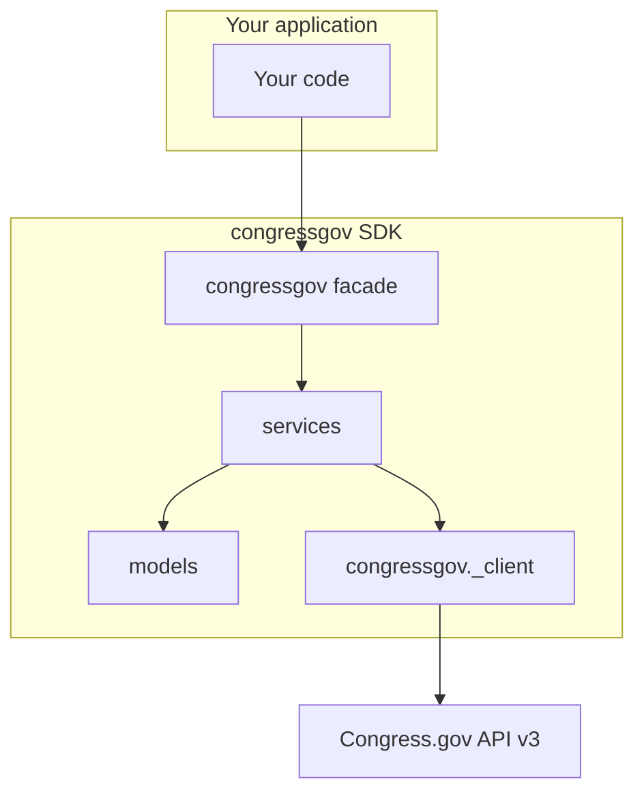

# congressgov

[](LICENSE)
[](https://www.python.org/downloads/)

**Python SDK for the [Congress.gov API](https://api.congress.gov)** — typed Pydantic models, high-level services, and query extensions.

Community client for the official [Congress.gov API specification](https://github.com/LibraryOfCongress/api.congress.gov) (not affiliated with the Library of Congress). **PyPI package:** [`congressgov`](https://pypi.org/project/congressgov/) · **This repo:** `congressgov-python`

## Features

- **Typed models** — Pydantic validation for bills, members, committees, and more
- **High-level services** — `Bill`, `Member`, `Committee`, and 15+ other resource classes
- **Query extensions** — `get_actions()`, `filter()`, `group_by()`, and chainable queries on collections
- **Async** — parallel `AsyncBill`, `AsyncMember`, … under `congressgov.async_api`

## Requirements

- Python **3.13+**
- A free [Congress.gov API key](https://api.congress.gov/sign-up/)

## Installation

Requires **2.0.0 or newer** for the current `src/` layout without legacy shims. Use **1.5.x** if you still need `import middleware` / `import models`; **1.0.0** did not ship a `congressgov` module at all.

```bash
pip install "congressgov>=2.0.0"
```

**Full install (all optional runtime features):**

```bash
pip install congressgov[all]
```

**From source (development):**

```bash
git clone https://github.com/CMD0112/congressgov-python.git
cd congressgov-python
poetry install --with dev,cache,export,batch,codegen
# Or: pip install -e ".[dev,all,codegen]"
```

First-time maintainers wiring a new GitHub remote: [docs/GITHUB_SETUP.md](docs/GITHUB_SETUP.md).

### API key

```bash
cp .env.example .env
# Set CONGRESS_API_KEY=your-key-here
```

Or export `CONGRESS_API_KEY` in your shell. The library reads it via `get_client_from_env()`.

API responses are persisted locally by default (`.congressgov/api/request_store.db`) so repeat
fetches are served from storage. Set `CONGRESS_WORKSPACE` to relocate the project workspace,
`CONGRESS_REQUEST_STORE` to change the blob backend, or pass `request_store=False` to disable.
Inspect the cache with `congressgov-store stats`.

## Quick start

```python
from congressgov import Bill, get_client_from_env

client = get_client_from_env()  # persists API responses locally by default
bill = Bill(client=client).get(congress=118, bill_type="hr", bill_number=1)

print(bill.title)
print(len(bill.get_actions() or []), "actions")
```

Run the sample scripts (with `CONGRESS_API_KEY` set):

```bash
poetry run python examples/quickstart.py
poetry run python examples/quickstart_async.py
poetry run python examples/network_graph_live.py
poetry run python examples/congress_roster_graph_live.py
```

The **network graph** example fetches a bill batch and writes `examples/output/network_graph/live_network_explorer.html`. The **congress roster graph** example seeds the full member roster, persists bills over time, and writes `examples/output/congress_roster_graph/roster_graph_explorer.html`.

### Async

```python
from congressgov.async_api import AsyncBill

bill = await AsyncBill(client=client).get(
    congress=118, bill_type="hr", bill_number=1
)
```

## Architecture



| Layer | Import | Role |
|-------|--------|------|
| Facade | `congressgov` | Canonical public API (`Bill`, `Member`, …) |
| Services | `congressgov.services` | High-level API services |
| Models | `congressgov.models` | Parsed, validated data |
| Client | `congressgov.client` or `congressgov._client` | Generated HTTP calls |

## Optional features

Caching, batch jobs, export, and rate limiting require optional extras (lazy-imported from `congressgov`):

| Extra | Install | Enables |
|-------|---------|---------|
| `cache` | `pip install congressgov[cache]` | Request store Redis backend, `RateLimiter`, TTL caches |
| `export` | `pip install congressgov[export]` | `DataExporter`, `PandasIntegration`, … |
| `graph` | `pip install congressgov[graph]` | Network graph builder, `CongressGraphStore`, Sigma HTML export |
| `batch` | `pip install congressgov[batch]` | `BatchProcessor`, … |
| `viz` | `pip install congressgov[viz]` | Matplotlib helpers in export visualization |
| `all` | `pip install congressgov[all]` | All optional runtime extras above |
| `codegen` | `pip install congressgov[codegen]` | Maintainer deps only; run `python -m codegen` from a git clone |

Storage: **[docs/STORAGE.md](docs/STORAGE.md)** (workspace layout, lanes, `congressgov-store` CLI) and
**[docs/REQUEST_STORE.md](docs/REQUEST_STORE.md)** (HTTP deduplication, offline replay).
Network graphs: **[docs/NETWORK_GRAPH.md](docs/NETWORK_GRAPH.md)** · construction methods: **[docs/GRAPH_CONSTRUCTION.md](docs/GRAPH_CONSTRUCTION.md)**.

Other optional features: **[docs/ADVANCED.md](docs/ADVANCED.md)**.

## Regenerating from OpenAPI

The committed client and models are generated from `codegen/config/openapi_spec.yaml`. To regenerate after spec changes:

```bash
poetry install --with codegen
poetry run python -m codegen validate-spec
poetry run python -m codegen generate-all
```

Stepwise: `python -m codegen generate-client`, `generate-models`, `generate-middleware`.

- **Spec:** `codegen/config/openapi_spec.yaml`
- **Config:** `codegen/config/generator_config.yaml`
- **Incremental mode** preserves `# CUSTOM:` blocks in generated files
- **Do not overwrite** hand-maintained `congressgov/services/async_api/bill.py`

Full workflow: **[docs/CODEGEN.md](docs/CODEGEN.md)** (see **[docs/README.md](docs/README.md)** for the full index).

## Documentation

| Guide | Contents |
|-------|----------|
| [docs/README.md](docs/README.md) | **Documentation index** (start here) |
| [docs/USAGE.md](docs/USAGE.md) | Getting started, async, errors, congressional record types |
| [docs/REFERENCE.md](docs/REFERENCE.md) | Services, client, models, extensions |
| [docs/MEMBERS_QUERY.md](docs/MEMBERS_QUERY.md) | `Members` collection query/filter helpers |
| [docs/ADVANCED.md](docs/ADVANCED.md) | Caching, batch, export, rate limits |
| [docs/REQUEST_STORE.md](docs/REQUEST_STORE.md) | HTTP request store, offline mode, policies |
| [docs/STORAGE.md](docs/STORAGE.md) | Unified workspace, storage lanes, `congressgov-store` |
| [docs/NETWORK_GRAPH.md](docs/NETWORK_GRAPH.md) | Sponsor/cosponsor graphs and interactive export |
| [docs/GRAPH_CONSTRUCTION.md](docs/GRAPH_CONSTRUCTION.md) | Graph construction methods and live script reference |
| [docs/ARCHITECTURE.md](docs/ARCHITECTURE.md) | Core vs extras, generated vs hand-maintained |
| [docs/PACKAGE_LAYOUT.md](docs/PACKAGE_LAYOUT.md) | Directory layout, wheel policy, 2.0 `src/` plan |
| [docs/MIGRATION.md](docs/MIGRATION.md) | Import path changes (1.1 → 2.0) |
| [docs/VERSIONING.md](docs/VERSIONING.md) | SemVer, deprecations, stability scope |
| [docs/CODEGEN.md](docs/CODEGEN.md) | OpenAPI code generation (maintainers) |
| [docs/API_COVERAGE.md](docs/API_COVERAGE.md) | OpenAPI path coverage matrix (maintainers) |
| [docs/PUBLISHING.md](docs/PUBLISHING.md) | PyPI trusted publishing (maintainers) |

## Contributing

See [CONTRIBUTING.md](CONTRIBUTING.md). Security: [SECURITY.md](SECURITY.md). Releases: [CHANGELOG.md](CHANGELOG.md).

## License

[Apache-2.0](LICENSE)
