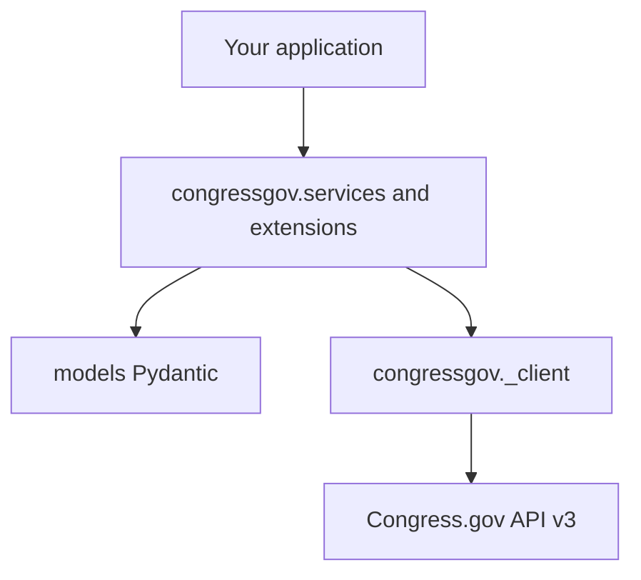

# Architecture

How **congressgov** is structured for long-term maintenance: OpenAPI-driven generation, a stable core install, and optional extras for features the Congress.gov spec does not describe.

**Using the SDK:** [USAGE.md](USAGE.md) and [VERSIONING.md](VERSIONING.md). **Maintainers:** this file, [CODEGEN.md](CODEGEN.md), [API_COVERAGE.md](API_COVERAGE.md).

## Layers

| Layer | Import | Source |
|-------|--------|--------|
| Facade | `congressgov` | Re-exports services, client helpers, lazy extras |
| Services | `congressgov.services` | Hybrid: services, extensions, `core/` |
| Models | `congressgov.models` | Hybrid: generated + hand-maintained bases |
| HTTP client | `congressgov.client` / `congressgov._client` | Generated (`openapi-python-client`) |
| Async | `congressgov.async_api` | Hand-maintained (mirrors sync) |

Package layout policy: [PACKAGE_LAYOUT.md](PACKAGE_LAYOUT.md).

## Core vs optional install

| Install | Includes |
|---------|----------|
| `pip install congressgov` | Client, models, all services **code**; eager imports for `Bill`, `Member`, … |
| `pip install congressgov[cache]` | Redis, diskcache, SQLAlchemy for caching / rate limits |
| `pip install congressgov[export]` | pandas, pyarrow, openpyxl for export |
| `pip install congressgov[batch]` | psutil, tqdm for batch processing |
| `pip install congressgov[all]` | All optional runtime deps |
| `pip install congressgov[codegen]` | Maintainer codegen **dependencies** only (run CLI from git clone) |

Consumer wheels **exclude** the `codegen` package; maintainers use `poetry run python -m codegen …` from a source checkout (codegen is included in sdists).

Lazy imports: `from congressgov import DataExporter` loads the export stack only when accessed and requires `[export]` or `[all]`.

## Generated vs hand-maintained

| Category | Paths | Regenerated by `generate-all`? |
|----------|-------|--------------------------------|
| API client | `congressgov/_client/` | Yes |
| Models | `congressgov/models/` | Partially (incremental; `# CUSTOM:` preserved) |
| Sync services | `congressgov/services/*.py` (top-level) | Partially |
| Extensions | `congressgov/services/extensions/` | Partially |
| Core framework | `congressgov/services/core/` | **No** (protected) |
| Request store | `congressgov/services/core/request_store/` | **No** (protected) |
| Workspace / storage lanes | `congressgov/services/core/workspace/`, `storage_lanes/`, `store_registry/`, `congressgov/storage/` | **No** (protected) |
| Async | `congressgov/services/async_api/` | **No** (protected; bill files always manual) |
| Caching / export / batch / rate limit | `congressgov/services/caching/`, `export/`, `batch/`, `rate_limiting/` | **No** (protected) |
| Bill / Amendment (pilot) | `congressgov/services/bill.py`, `extensions/bill.py`, `amendment`, `actions` | **No** (protected) |
| Codegen | `codegen/` | Hand-maintained tooling |

Protected paths are listed in [`codegen/config/generator_config.yaml`](../codegen/config/generator_config.yaml) and enforced by the file manager (skipped writes + log line).

## Spec update workflow

1. Update `codegen/config/openapi_spec.yaml` (and `entity_mappings.yaml` if needed).
2. `poetry install --with codegen`
3. `poetry run python -m codegen validate-spec`
4. `poetry run python -m codegen generate-all` (or stepwise commands)
5. Review diff; run `ruff` / `mypy`; update [CHANGELOG.md](../CHANGELOG.md) if APIs changed

See [CODEGEN.md](CODEGEN.md).

## Async discipline

`congressgov.services.async_api` is a hand-maintained mirror of sync services. After changing sync `get`/`search` signatures, update the matching async module. Do not overwrite:

- `congressgov/services/async_api/bill.py`

### Intentional dual sync/async design (not a refactor target)

**Pydantic models are canonical** — one `Bill`, one `Member`, etc. in `congressgov.models`; both sync and async code paths validate into the same types.

**Services and extensions are duplicated by design** — parallel modules under `congressgov/services/` and `congressgov/services/async_api/`, plus matching `extensions/` and `extensions/async/` helpers. There is no runtime “cast as sync or async” API; callers choose `Bill` vs `AsyncBill` and the matching extension method names (`fetch` vs `fetch_async`).

**Parity is enforced in CI** — `tests/test_async_service_parity.py` (service methods) and `tests/test_async_extension_parity.py` (instance/url-follow extensions).

**Future improvement path** — codegen async mirrors from sync (or a unified service base accepting sync/async client callables), not a single runtime-dispatch layer. Full async/sync unification is deferred.

### Deferred: optional NLP for large text

Large text fields (`Summary.text`, `Treaty.resolutionText`, bill text URLs) remain plain `str` or URL metadata today. A future optional `congressgov[nlp]` extra would follow the lazy-import pattern in `congressgov.services.__init__` (`_LAZY_EXPORTS` + install hints). Not planned for core packaging.

### Summary entity

Bill-embedded CRS summaries use `Summary` / `Summaries` in `congressgov.models.entities.bill`. Global summary search uses the `Summaries` service. No separate top-level summary domain model is required beyond these types.

## Regen baseline

The merged OpenAPI spec (`congressgov_openapi_base.yaml` + `openapi_spec_annotations.yaml` via `merge-openapi-spec`) is the single source for `validate-spec` and generation. Hand-maintained services and extensions are on `protected_paths`; with `emit_review_sidecars: false` (default), `generate-middleware` / `generate-extensions` skip those files instead of writing sidecars.

**Model registry:** `generate-registry` writes `congressgov/services/core/model_registry_generated.py`; hand `model_registry.py` merges `MODEL_PATH_MAP` with `HAND_MODEL_OVERRIDES`.

Protected-path list, CLI commands, merge sanitization, and troubleshooting: **[CODEGEN.md](CODEGEN.md)**.

## Storage architecture

Persistent data uses a **workspace** (default `.congressgov/`) with **lanes**:

| Lane | Module | Role |
|------|--------|------|
| Blob | `core/request_store/` | Raw API response deduplication |
| Record | `export/graph/store.py` | Incremental graph datasets |
| Table | `core/storage.py` | Model collections (SQL/file) |
| Artifact | `core/storage_lanes/` | Export outputs |

`congressgov.storage` and `congressgov.services.Workspace` / `StoreRegistry` provide the unified entry points. See **[STORAGE.md](STORAGE.md)**.

## Future direction

API path coverage is tracked in [`API_COVERAGE.md`](API_COVERAGE.md); CI enforces zero `service_method` gaps via `poetry run python -m codegen.scripts.api_coverage_matrix --check-service-methods`. **Bill** extensions remain the largest hand-maintained surface. Hand async modules under `congressgov/services/async_api/` stay protected; `tests/test_async_service_parity.py` ensures every sync public method exists on async with matching signatures.

**2.0 note:** Top-level `import middleware` and `import models` were removed. Use `congressgov` / `congressgov.services` / `congressgov.models` only. See [MIGRATION.md](MIGRATION.md).
