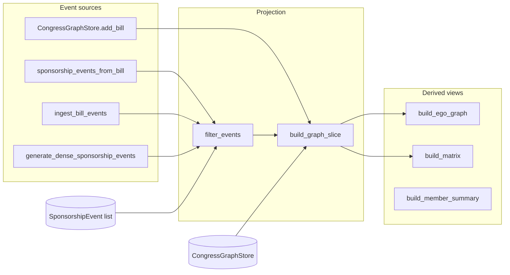

# Graph construction methods

Reference for every way to build sponsor/cosponsor network graphs in
`congressgov.services.export.graph`. For export formats, interactive HTML controls,
and interpretation notes, see [NETWORK_GRAPH.md](NETWORK_GRAPH.md).

Install the graph extra when you need NetworkX spring layouts (SciPy recommended for
large graphs):

```bash
pip install congressgov[graph]
# or from source: poetry install --with export,graph
```

## Pipeline overview

All graph construction follows the same layered pipeline:

```plain text
Bills (API or in-memory)
    → SponsorshipEvent rows (one per sponsor/cosponsor pair per bill)
    → filter + aggregate (GraphExploreConfig)
    → GraphSlice (nodes, edges, layout, limits)
    → export (HTML, JSON, CSV, GraphML, …)
```



`SponsorshipEvent` is the raw, auditable layer: one row per sponsor/cosponsor
pair on one bill. `GraphSlice` is a filtered projection built from those events:
aggregated member-pair edges with layout coordinates, community labels, and
truncation metadata.

## Method catalog

| Method | Module | Input | Output | Persists data? |
|--------|--------|-------|--------|----------------|
| `sponsorship_events_from_bill` | `sources` | One `Bill` (+ optional cosponsors) | `list[SponsorshipEvent]` | No |
| `sponsorship_events_from_bills` | `sources` | Iterable of `Bill` | `list[SponsorshipEvent]` | No |
| `iter_sponsorship_events_from_bills` | `sources` | Iterable of `Bill` | Iterator of events | No |
| `ingest_bill_events` | `ingestion` | `Bill` service + `GraphIngestionConfig` | `list[SponsorshipEvent]` | Optional skip via `graph_store` |
| `ingest_bill_events_async` | `ingestion` | Async bill service + config | `list[SponsorshipEvent]` | No |
| `build_graph_from_bills` | `ingestion` | In-memory bills + `GraphExploreConfig` | `GraphSlice` | No |
| `build_graph_slice` | `builder` | Events + `GraphExploreConfig` | `GraphSlice` | No |
| `CongressGraphStore.build_slice` | `store` | Persisted store + config | `GraphSlice` | Reads persisted dataset |
| `CongressGraphStore.add_bill` | `store` | One `Bill` (+ cosponsors) | `BillIngestResult` | Yes (on `save()`) |
| `generate_dense_sponsorship_events` | `synthetic` | Size parameters | `list[SponsorshipEvent]` | No |
| `build_ego_graph` | `builder` | Events + member ID + `EgoNetworkConfig` | `GraphSlice` | No |
| `build_matrix` | `builder` | Events + `GraphExploreConfig` | `MatrixSlice` | No |

## Choosing a workflow

| Goal | Recommended path | Example |
|------|------------------|---------|
| Quick one-shot graph from a bill batch | `ingest_bill_events` → `build_graph_slice` | [`examples/network_graph_live.py`](../examples/network_graph_live.py) |
| Full Congress roster + incremental bills over time | `CongressGraphStore` seed → `add_bill` → `build_slice` | [`examples/congress_roster_graph_live.py`](../examples/congress_roster_graph_live.py) |
| Offline / notebook exploration with sample data | `sponsorship_events_from_bill` on `Bill.model_validate(...)` | [`examples/network_graph_exploration.ipynb`](../examples/network_graph_exploration.ipynb) |
| Already have `Bill` objects in memory | `build_graph_from_bills` or `sponsorship_events_from_bills` | See below |
| Stress-test layouts without API calls | `generate_dense_sponsorship_events` → `build_graph_slice` | [`examples/scripts/stress_dense_graphs.py`](../examples/scripts/stress_dense_graphs.py) |
| Rebuild HTML from saved JSON | Load JSON → `export_interactive_html` | [`examples/scripts/reexport_explorer_from_json.py`](../examples/scripts/reexport_explorer_from_json.py) |

### Network graph vs congress roster graph

| | **Network graph** | **Congress roster graph** |
|--|-------------------|---------------------------|
| Member nodes | Only members with sponsorship edges in the batch | Full Congress roster (including isolated members) |
| Persistence | Ephemeral per run | `.congressgov/datasets/graphs/{congress}.json` |
| Bill deduplication | None (re-fetch adds duplicate events unless you filter) | `add_bill` skips already-ingested bill IDs |
| `include_all_members` | Default `False` | Set `True` in `GraphExploreConfig` (roster script does this) |
| Typical script | `network_graph_live.py` | `congress_roster_graph_live.py` |

---

## 1. Event extraction from bills

Lowest-level constructors. Use these when you already have `Bill` models (from the
API, fixtures, or `Bill.model_validate`).

### `sponsorship_events_from_bill`

Expands one bill into sponsor→cosponsor event rows. Cosponsors can be passed
explicitly (e.g. from `bill.get_cosponsors()`) or read from `bill.cosponsors`.

```python
from congressgov import Bill, get_client_from_env
from congressgov.services.export.graph import sponsorship_events_from_bill

client = get_client_from_env()
bill = Bill(client=client).get(congress=118, bill_type="hr", bill_number=1)
cosponsors = bill.get_cosponsors(limit=250)
events = sponsorship_events_from_bill(bill, cosponsors)
```

Each event carries bill metadata (title, policy area, dates), sponsor/cosponsor
bioguide IDs, party/state/district, original vs late cosponsorship, and withdrawal
status.

### `sponsorship_events_from_bills` / `iter_sponsorship_events_from_bills`

Batch variants. Pass an optional `fetch_cosponsors` callable when cosponsors are
not embedded on each bill:

```python
from congressgov.services.export.graph import sponsorship_events_from_bills

events = sponsorship_events_from_bills(
    bills,
    fetch_cosponsors=lambda bill: bill.get_cosponsors(limit=250),
)
```

Use `iter_sponsorship_events_from_bills` when you want to stream events without
building a large intermediate list.

---

## 2. API ingestion

Fetch bills from Congress.gov and expand them into events in one step.

### `ingest_bill_events`

```python
from congressgov import Bill, get_client_from_env
from congressgov.services.export.graph import GraphIngestionConfig, ingest_bill_events

client = get_client_from_env()
bill_service = Bill(client=client)

events = ingest_bill_events(
    bill_service,
    GraphIngestionConfig(
        congress=118,
        bill_type="hr",
        batch_size=50,          # max bills from search
        cosponsor_limit=250,    # per-bill cosponsor cap
    ),
    fetch_cosponsors=True,
)
```

Behavior:

- Calls `bill_service.search(congress=..., bill_type=..., limit=batch_size)`.
- Hydrates bills via `bill_service.get(...)` when search payloads omit sponsors or
  member display metadata.
- Fetches cosponsors per bill when `fetch_cosponsors=True`.
- Optional `graph_store`: skips bills whose IDs are already in a
  `CongressGraphStore` (useful when mixing ingestion with persistence).
- Optional `limit`: cap total events returned.

### `ingest_bill_events_async`

Same contract for async bill services using `search_stream`:

```python
from congressgov.async_api import AsyncBill
from congressgov.services.export.graph import GraphIngestionConfig, ingest_bill_events_async

async def fetch_events():
    service = AsyncBill(client=async_client)
    return await ingest_bill_events_async(
        service,
        GraphIngestionConfig(congress=118, bill_type="hr", batch_size=100),
        max_bills=50,
        fetch_cosponsors=True,
    )
```

### `build_graph_from_bills`

Convenience shortcut: expand in-memory bills to events, then call
`build_graph_slice`:

```python
from congressgov.services.export.graph import (
    GraphExploreConfig,
    build_graph_from_bills,
)

graph = build_graph_from_bills(
    bills,
    GraphExploreConfig(congress=118, min_weight=1, max_edges=3000),
    fetch_cosponsors=True,
    cosponsor_limit=250,
)
```

---

## 3. Building graph slices

### `build_graph_slice`

Core projection builder. Filters events, aggregates edges, applies `min_weight` and
`max_edges`, computes layout and optional community/centrality metrics.

```python
from congressgov.services.export.graph import GraphExploreConfig, build_graph_slice

graph = build_graph_slice(
    events,
    GraphExploreConfig(
        congress=118,
        bill_type="hr",              # optional filter
        min_weight=2,                # minimum active relationship count
        max_edges=1500,                # top-N edge cap
        projection="sponsor_to_cosponsor",  # or "collaboration"
        include_all_members=False,     # True = keep roster members with no edges
        compute_communities=True,
        compute_advanced_metrics=True,
        layout_algorithm="spring",
    ),
    member_resolver=member_resolver,   # optional label enrichment
)
```

Key `GraphExploreConfig` fields for construction:

| Field | Default | Purpose |
|-------|---------|---------|
| `congress` | required | Restrict to one Congress |
| `bill_type` | `None` | Optional type filter (`hr`, `s`, …) |
| `chamber` | `all` | `house`, `senate`, or `all` |
| `policy_area` | `None` | Filter by policy area name |
| `min_weight` | `1` | Drop edges below this active weight |
| `max_edges` | `3000` | Cap displayed edges; sets truncation metadata |
| `cross_party_only` | `False` | Keep only bipartisan ties |
| `original_only` | `False` | Keep only original cosponsorships |
| `include_withdrawn` | `False` | Include withdrawn cosponsorships in weights |
| `include_all_members` | `False` | Include roster members without edges |
| `projection` | `sponsor_to_cosponsor` | Or `collaboration` (undirected pairs) |
| `layout_algorithm` | `spring` | `force_directed`, `kamada_kawai`, `circular`, `shell_party` |
| `compute_communities` | `True` | Greedy modularity communities |
| `compute_advanced_metrics` | `True` | Betweenness and PageRank (size-capped) |

Pass `member_registry` (a `dict[str, GraphMemberNode]`) when building with
`include_all_members=True` so isolated roster members appear as nodes. The roster
store supplies this automatically via `CongressGraphStore.build_slice`.

### Derived views (same event layer)

These build alternate views without replacing the main slice workflow:

```python
from congressgov.services.export.graph import (
    EgoNetworkConfig,
    build_ego_graph,
    build_matrix,
    build_member_summary,
    get_edge_evidence,
    rank_relationships,
)

summary = build_member_summary(events, "B001230", GraphExploreConfig(congress=118))
evidence = get_edge_evidence(events, "B001230", "C001111", GraphExploreConfig(congress=118))
ego = build_ego_graph(events, "B001230", EgoNetworkConfig(congress=118, depth=2))
matrix = build_matrix(events, GraphExploreConfig(congress=118), sort="party")
ranked = rank_relationships(events, GraphExploreConfig(congress=118), top_n=25)
```

---

## 4. Persistent congress roster graph

`CongressGraphStore` keeps a member-first dataset for one Congress on disk
(`.congressgov/datasets/graphs/{congress}.json` by default).

### Lifecycle

```plain text
open store → seed members (once) → add bills (repeat) → save → build_slice
```

```python
from congressgov import Bill, Member, get_client_from_env
from congressgov.services.core.workspace import Workspace
from congressgov.services.export.graph import (
    CongressGraphStore,
    GraphExploreConfig,
    create_member_label_resolver,
    export_interactive_html,
)

client = get_client_from_env()
workspace = Workspace.open(".congressgov")
store = workspace.open_graph(118)

# 1. Seed full roster (once)
if store.member_count == 0:
    store.seed_members_from_service(Member(client=client), fetch_all=True)
    store.save()

# 2. Add bills incrementally (skips duplicates)
bill = Bill(client=client).get(congress=118, bill_type="hr", bill_number=1)
cosponsors = bill.get_cosponsors(limit=250)
result = store.add_bill(bill, cosponsors)
if result.added:
    store.save()

# 3. Build slice with full roster
member_resolver = create_member_label_resolver(Member(client=client), congress=118)
store.resolve_member_labels(member_resolver, save=True)

graph = store.build_slice(
    GraphExploreConfig(congress=118, include_all_members=True, min_weight=1),
    member_resolver=member_resolver,
)
export_interactive_html(graph, "roster_graph.html")
```

### Store API summary

| Method | Purpose |
|--------|---------|
| `CongressGraphStore.open(path, congress=…)` | Open or create dataset file |
| `CongressGraphStore.load(path)` | Load existing file (raises if missing and no congress) |
| `CongressGraphStore.open_for_workspace(workspace, congress)` | Resolve path via workspace |
| `seed_members(members)` | Add `Member` nodes without removing existing |
| `seed_members_from_service(member_service)` | Fetch and seed full Congress roster |
| `add_bill(bill, cosponsors, save=False)` | Ingest one bill; skip if bill ID seen |
| `add_bills(bills, fetch_cosponsors=False)` | Batch ingest |
| `resolve_member_labels(member_resolver)` | Upgrade display names from Member API |
| `build_slice(config, member_resolver=…)` | Project persisted events (+ optional full roster) |
| `save()` | Atomic write to JSON |
| `stats()` | `{congress, memberCount, eventCount, billCount}` |

---

## 5. Synthetic stress data

`generate_dense_sponsorship_events` builds highly connected fake events without API
calls. Useful for layout, truncation, and HTML renderer profiling.

```python
from congressgov.services.export.graph import (
    GraphExploreConfig,
    assess_graph_slice,
    build_graph_slice,
    generate_dense_sponsorship_events,
    recommend_explore_config,
)

events = generate_dense_sponsorship_events(
    member_count=120,
    bills_per_sponsor=25,
    cosponsors_per_bill=40,
    congress=118,
    seed=42,
)
config = GraphExploreConfig(congress=118, min_weight=1, max_edges=3000)
graph = build_graph_slice(events, config)
assessment = assess_graph_slice(graph)
safer = recommend_explore_config(config, assessment)
```

Run the stress script:

```bash
poetry run python examples/scripts/stress_dense_graphs.py
```

Writes `examples/output/network_graph/dense_*.html` for medium, large, and very large
scenarios.

---

## 6. CLI reference

Graph-related example scripts are invoked with `poetry run python` from the
repository root (or `python` after `pip install -e ".[export,graph]"`).

### Prerequisites

```bash
cp .env.example .env
# Edit .env and set CONGRESS_API_KEY to your Congress.gov API key
```

Both live scripts read the API key from `--env-file` (default: `.env` at the repo
root). They fail with exit code `1` when:

- The env file is missing
- `CONGRESS_API_KEY` is unset or still the `.env.example` placeholder
- No sponsorship events are returned (try more bills or a different `--bill-type`)

API responses are cached in the request store (`.congressgov/api/` by default);
repeat runs reuse stored responses.

---

### `network_graph_live.py`

Builds an ephemeral sponsor/cosponsor graph from a live bill batch. Members
appear only when they have sponsorship ties in the fetched bills.

```bash
poetry run python examples/network_graph_live.py [OPTIONS]
# or: poetry run python examples/network_graph_live.py --help
```

| Flag | Type | Default | Description |
|------|------|---------|-------------|
| `-h`, `--help` | — | — | Show usage and exit |
| `--congress` | int | `118` | Congress number to search bills in |
| `--bill-type` | choice | `hr` | Bill type filter. Choices: `hr`, `s`, `hjres`, `sjres`, `hconres`, `sconres`, `hres`, `sres` |
| `--max-bills` | int | `25` | Maximum bills to fetch and expand into sponsorship events per run |
| `--max-edges` | int | `1500` | Maximum edges in the exported graph slice (`GraphExploreConfig.max_edges`) |
| `--min-weight` | int | `1` | Minimum active relationship count per edge (`GraphExploreConfig.min_weight`) |
| `--no-safer-filters` | flag | off | Use `--min-weight` and `--max-edges` exactly; skip density auto-tuning |
| `--output-dir` | path | `examples/output/network_graph` | Directory for HTML and JSON artifacts |
| `--env-file` | path | `.env` | Path to the dotenv file containing `CONGRESS_API_KEY` |
| `--workspace-exports` | flag | off | Also write HTML/JSON to `.congressgov/exports/network_graph/{congress}_{bill_type}/` |

Examples:

```bash
# Defaults: 118th Congress, HR bills, 25 bills
poetry run python examples/network_graph_live.py

# Larger batch, Senate bills
poetry run python examples/network_graph_live.py --congress 118 --bill-type s --max-bills 40

# Tighter graph filters
poetry run python examples/network_graph_live.py --min-weight 2 --max-edges 800

# Honor explicit limits even on dense graphs
poetry run python examples/network_graph_live.py --max-edges 10000 --no-safer-filters

# Custom output location and env file
poetry run python examples/network_graph_live.py \
  --output-dir /tmp/graph_out \
  --env-file /path/to/.env

# Mirror artifacts into the workspace exports lane
poetry run python examples/network_graph_live.py --workspace-exports
```

Output files (under `--output-dir`):

| File | Description |
|------|-------------|
| `live_network_explorer.html` | Standalone Sigma.js interactive explorer |
| `live_graph_api.json` | Graph slice JSON (sigma/API payload) |
| `live_graph_summary.json` | Run metadata: event/node/edge counts, density assessment, top relationships |

When `--workspace-exports` is set, matching HTML/JSON are also written under
`.congressgov/exports/network_graph/{congress}_{bill_type}/`.

When the exported slice is truncated (eligible edges exceed `--max-edges`),
`recommend_explore_config` may raise the effective `--min-weight` and/or lower
`--max-edges` before export; if the slice already fits your limits, your
values are kept as-is. Pass `--no-safer-filters` to skip this tuning
entirely — a message is printed whenever filters change.

Exit codes: `0` on success, `1` on configuration/API/event errors.

---

### `congress_roster_graph_live.py`

Builds a persistent member-first graph: seed the full Congress roster, then
incrementally add bills. Dataset state is saved between runs.

```bash
poetry run python examples/congress_roster_graph_live.py [OPTIONS]
# or: poetry run python examples/congress_roster_graph_live.py --help
```

| Flag | Type | Default | Description |
|------|------|---------|-------------|
| `-h`, `--help` | — | — | Show usage and exit |
| `--congress` | int | `118` | Congress number for roster seeding and bill search |
| `--bill-type` | choice | `hr` | Bill type filter. Choices: `hr`, `s`, `hjres`, `sjres`, `hconres`, `sconres`, `hres`, `sres` |
| `--max-bills` | int | `25` | Maximum bills to fetch and merge into the dataset per run |
| `--max-edges` | int | `1500` | Maximum edges in the exported graph slice |
| `--min-weight` | int | `1` | Minimum active relationship count per edge |
| `--no-safer-filters` | flag | off | Use `--min-weight` and `--max-edges` exactly; skip density auto-tuning |
| `--all-bill-types` | flag | off | Export all ingested bill types in the slice (`bill_type=None`); `--bill-type` still controls ingestion search |
| `--output-dir` | path | `examples/output/congress_roster_graph` | Directory for HTML and JSON artifacts |
| `--env-file` | path | `.env` | Path to the dotenv file containing `CONGRESS_API_KEY` |
| `--store-path` | path | *(workspace default)* | Override path for the persistent roster dataset JSON. When omitted, uses `.congressgov/datasets/graphs/{congress}.json` via `Workspace.open_graph()` |
| `--workspace-exports` | flag | off | Also write HTML/JSON to `.congressgov/exports/congress_roster_graph/{congress}_{bill_type}/` |

Examples:

```bash
# First run: seeds ~535 members, fetches 25 HR bills, saves dataset
poetry run python examples/congress_roster_graph_live.py

# Subsequent runs: loads existing dataset, skips already-ingested bills, adds new ones
poetry run python examples/congress_roster_graph_live.py --max-bills 40

# Custom dataset location
poetry run python examples/congress_roster_graph_live.py \
  --store-path data/my_118_roster.json \
  --congress 118

# Different bill type with workspace artifact mirror
poetry run python examples/congress_roster_graph_live.py \
  --bill-type s \
  --max-bills 30 \
  --workspace-exports

# Export every ingested bill type (e.g. after ingesting HR and S separately)
poetry run python examples/congress_roster_graph_live.py --all-bill-types --max-edges 10000
```

Output files (under `--output-dir`):

| File | Description |
|------|-------------|
| `roster_graph_explorer.html` | Interactive explorer (includes isolated roster members as nodes) |
| `roster_graph_api.json` | Graph slice JSON |
| `roster_graph_summary.json` | Run metadata plus `storeStats` (member/bill/event counts) |

Persistent dataset (default path): `.congressgov/datasets/graphs/{congress}.json`.
Re-running with the same Congress and store path skips bills whose IDs are
already recorded; the member roster is seeded only when `member_count == 0`.

A few behaviors here aren't controlled by CLI flags: `include_all_members=True`
is always set when building the slice, member display names are resolved and
saved back to the dataset when possible, and isolated members (no sponsorship
edges yet) still appear as nodes in the HTML.

Exit codes: `0` on success, `1` on configuration/API/event errors.

---

### Shared flags (both live scripts)

| Flag | Effect |
|------|--------|
| `--congress` | Passed to bill search, member label resolver, and `GraphExploreConfig` |
| `--bill-type` | Restricts `Bill.search(bill_type=…)` and graph filters |
| `--max-bills` | Caps bills processed per invocation (also used as ingestion `batch_size`) |
| `--max-edges` | Top-N edge cap; weaker edges dropped when graph is truncated |
| `--min-weight` | Drops edges whose active cosponsorship count is below this threshold |
| `--no-safer-filters` | Skips truncation-only density tuning; honors `--min-weight` / `--max-edges` exactly |
| `--all-bill-types` | *(roster script only)* Sets export `bill_type=None` so all ingested bills appear in the slice |
| `--output-dir` | Created if missing; all three output files are written here |
| `--env-file` | Loaded via `python-dotenv` before client creation |
| `--workspace-exports` | Calls `export_graph_slice_to_workspace()` with a script-specific prefix |

**`--bill-type` choices:**

| Value | Meaning |
|-------|---------|
| `hr` | House bill (default) |
| `s` | Senate bill |
| `hjres` | House joint resolution |
| `sjres` | Senate joint resolution |
| `hconres` | House concurrent resolution |
| `sconres` | Senate concurrent resolution |
| `hres` | House simple resolution |
| `sres` | Senate simple resolution |

---

### `reexport_explorer_from_json.py`

Rebuilds interactive HTML from a previously exported sigma-format JSON. No API
key required, and no argparse — just positional arguments.

```bash
poetry run python examples/scripts/reexport_explorer_from_json.py [JSON_PATH] [HTML_PATH]
```

| Argument | Position | Default | Description |
|----------|----------|---------|-------------|
| `JSON_PATH` | 1 | `examples/output/network_graph/live_graph_api.json` | Input graph JSON (sigma payload) |
| `HTML_PATH` | 2 | `examples/output/network_graph/live_network_explorer.html` | Output HTML path (overwritten) |

Examples:

```bash
# Re-export default live graph outputs
poetry run python examples/scripts/reexport_explorer_from_json.py

# Custom input/output
poetry run python examples/scripts/reexport_explorer_from_json.py \
  examples/output/congress_roster_graph/roster_graph_api.json \
  /tmp/roster_reexport.html
```

Prints the resolved HTML path on success. Exit code `0`.

---

### `stress_dense_graphs.py`

Profiles rendering on synthetic dense graphs. No CLI flags - scenarios and
output paths are hard-coded.

```bash
poetry run python examples/scripts/stress_dense_graphs.py
```

Writes to `examples/output/network_graph/`:

| Output file | Scenario parameters |
|-------------|---------------------|
| `dense_medium_notebook.html` | 80 members, 12 bills/sponsor, 30 cosponsors/bill |
| `dense_large.html` | 150 members, 15 bills/sponsor, 35 cosponsors/bill |
| `dense_very_large.html` | 250 members, 20 bills/sponsor, 40 cosponsors/bill |

Prints density tier, safer config, and payload size stats to stdout.

---

## 7. Notebook and other scripts

### `examples/network_graph_exploration.ipynb`

Builds up progressively, and doesn't need an API key for the early cells:

1. Offline sample bills - `sponsorship_events_from_bill` on validated `Bill` dicts
2. Graph slice - `build_graph_slice` with matplotlib/NetworkX preview
3. Workspace offline replay - `workspace.open_graph` + `build_slice` from persisted roster data
4. Live API (optional) - `ingest_bill_events` when `CONGRESS_API_KEY` is set
5. Dense synthetic - `generate_dense_sponsorship_events` stress section

CLI equivalents for the live notebook cells are documented in [§6 CLI reference](#6-cli-reference).

---

## 8. Density helpers

Call after building a slice to tune filters before export:

```python
from congressgov.services.export.graph import (
    assess_graph_slice,
    profile_graph_rendering,
    recommend_explore_config,
)

assessment = assess_graph_slice(graph)
# assessment.tier: small | medium | large | very_large
# assessment.recommended_view: overview | matrix | ego | tables

safer_config = recommend_explore_config(original_config, assessment)
graph = build_graph_slice(events, safer_config)

profile = profile_graph_rendering(graph)  # payload size / build timing
```

Both live scripts apply `recommend_explore_config` automatically when the initial
slice is too dense.

---

## 9. Member labels

Display names use the congressional format
`Rep./Sen. Last, First [Party-State-District]`. Resolve labels from the Member API
when bill payloads omit `fullName`:

```python
from congressgov import Member
from congressgov.services.export.graph import create_member_label_resolver

member_resolver = create_member_label_resolver(
    Member(client=client),
    congress=118,
    client=client,
)
graph = build_graph_slice(events, config, member_resolver=member_resolver)
```

The roster store can persist upgraded labels via `store.resolve_member_labels(member_resolver)`.

---

## Related documentation

- [NETWORK_GRAPH.md](NETWORK_GRAPH.md): projections, export formats, interactive explorer UI
- [STORAGE.md](STORAGE.md): `.congressgov/` workspace lanes (datasets, exports, API cache)
- [REQUEST_STORE.md](REQUEST_STORE.md): HTTP response persistence used by live scripts
- [ADVANCED.md](ADVANCED.md): optional `graph`, `export`, and `viz` extras
