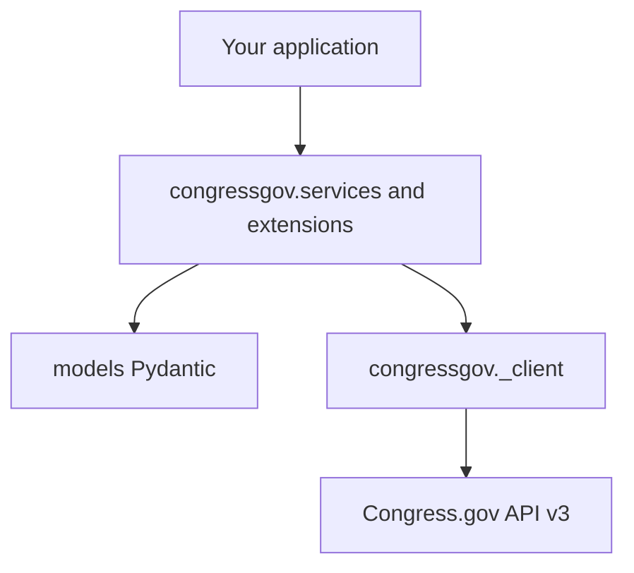

# Architecture

How **congressgov** is put together: an OpenAPI-driven client and models underneath, a stable core install, and optional extras for features the Congress.gov spec doesn't describe. Understanding this layout helps you know which imports are stable, what's lazy-loaded, and why some parts of the SDK feel hand-written while others look generated.

Getting started instead: [USAGE.md](USAGE.md) and [VERSIONING.md](VERSIONING.md).

## Layers

| Layer | Import | Source |
|-------|--------|--------|
| Facade | `congressgov` | Re-exports services, client helpers, lazy extras |
| Services | `congressgov.services` | Hybrid: services, extensions, `core/` |
| Models | `congressgov.models` | Hybrid: generated + hand-maintained bases |
| HTTP client | `congressgov.client` / `congressgov._client` | Generated (`openapi-python-client`) |
| Async | `congressgov.async_api` | Hand-maintained (mirrors sync) |

Package layout policy: [PACKAGE_LAYOUT.md](PACKAGE_LAYOUT.md).

## Core vs optional install

| Install | Includes |
|---------|----------|
| `pip install congressgov` | Client, models, all services **code**; eager imports for `Bill`, `Member`, … |
| `pip install congressgov[cache]` | Redis, diskcache, SQLAlchemy for caching / rate limits |
| `pip install congressgov[export]` | pandas, pyarrow, openpyxl for export |
| `pip install congressgov[batch]` | psutil, tqdm for batch processing |
| `pip install congressgov[all]` | All optional runtime deps |

Lazy imports: `from congressgov import DataExporter` loads the export stack only when accessed and requires `[export]` or `[all]`.

## Generated vs hand-maintained

The HTTP client under `congressgov._client` is regenerated straight from the Congress.gov OpenAPI spec. Everything under `congressgov.services.core`, `congressgov.services.async_api`, and the optional feature packages (`caching`, `export`, `batch`, `rate_limiting`) is hand-maintained and never touched by codegen. Top-level services and extensions (`congressgov/services/*.py`, `congressgov/services/extensions/`) sit in between: most started as generated stubs and are now hand-edited, so a regeneration run leaves them alone rather than overwriting your changes.

If you're contributing to the SDK itself and need the full protected-path list and regeneration workflow, see the maintainer runbook: [CODEGEN.md](../maintainers/CODEGEN.md).

## Storage architecture

Persistent data uses a **workspace** (default `.congressgov/`) with **lanes**:

| Lane | Module | Role |
|------|--------|------|
| Blob | `core/request_store/` | Raw API response deduplication |
| Record | `export/graph/store.py` | Incremental graph datasets |
| Table | `core/storage.py` | Model collections (SQL/file) |
| Artifact | `core/storage_lanes/` | Export outputs |

`congressgov.storage` and `congressgov.services.Workspace` / `StoreRegistry` provide the unified entry points. See **[STORAGE.md](STORAGE.md)**.

## Async design

`congressgov.services.async_api` is a hand-maintained mirror of the sync services — one `Bill` model serves both, but `Bill` and `AsyncBill` are separate service classes with matching method names (`fetch` vs `fetch_async`). There's no runtime "cast as sync or async" API; you pick the class that matches how you're calling it. Sync/async parity is enforced in CI, so a method added to one side is expected on the other.

## 2.0 migration note

Top-level `import middleware` and `import models` were removed in 2.0. Use `congressgov` / `congressgov.services` / `congressgov.models` only. See [MIGRATION.md](MIGRATION.md).
